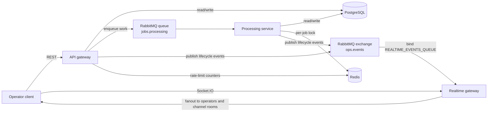
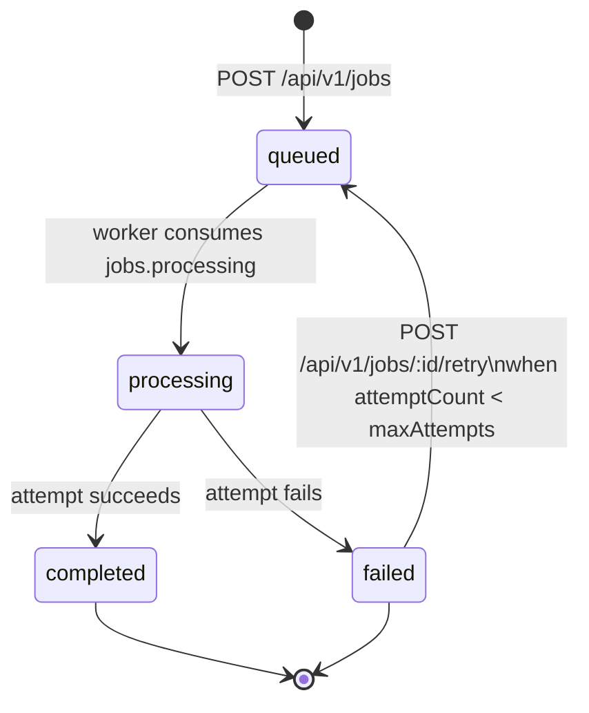
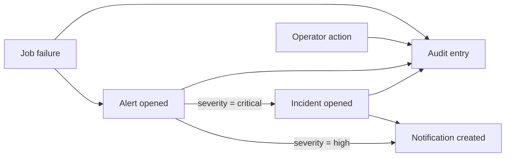

# Realtime Ops Platform

Operational workflow backend for queued jobs, incident response, and live operator visibility.

Realtime Ops Platform is a NestJS microservices portfolio repository that shows how to combine PostgreSQL, RabbitMQ, Redis, and WebSockets into a cohesive operational control plane. The repository is intentionally backend-first: command handling, asynchronous execution, auditability, and realtime fanout are treated as first-class system concerns rather than add-ons around CRUD endpoints.

## Quick Navigation

- [Why This Repository Matters](#why-this-repository-matters)
- [Architecture Overview](#architecture-overview)
- [Workflow and Lifecycle Model](#workflow-and-lifecycle-model)
- [Capability Matrix](#capability-matrix)
- [API Overview](#api-overview)
- [Realtime and WebSocket Overview](#realtime-and-websocket-overview)
- [Local Workflow](#local-workflow)
- [Validation and Quality](#validation-and-quality)
- [Repository Structure](#repository-structure)
- [Docs Map](#docs-map)
- [Scope Boundaries](#scope-boundaries)
- [Future Improvements](#future-improvements)

## Why This Repository Matters

This repository is designed to read like a serious backend/platform project rather than a starter API:

- It separates request handling, background execution, and realtime fanout into independent NestJS runtimes.
- It treats PostgreSQL as the system of record while RabbitMQ carries work and lifecycle events between services.
- It models operational workflows end to end: jobs, processing attempts, alert escalation, incident handling, notifications, and audit history.
- It includes the practical controls that make backend systems believable in review: validation, typed contracts, Redis-backed rate limiting, processing locks, tests, CI, Dockerized local execution, and explicit scope boundaries.

The result is more than a jobs backend. It is a small operational platform with a clear control path from API command to worker execution to operator-facing visibility.

## Architecture Overview

### Runtime Responsibilities

| Component            | Role in the system             | Primary responsibilities                                                                                                                         |
| -------------------- | ------------------------------ | ------------------------------------------------------------------------------------------------------------------------------------------------ |
| `api-gateway`        | Authenticated REST entry point | Validates requests, persists command-side records, exposes read models, enqueues jobs, emits initial lifecycle events                            |
| `processing-service` | Queue worker                   | Consumes `jobs.processing`, acquires Redis locks, records attempts, completes or fails jobs, raises alerts, opens incidents on critical failures |
| `realtime-gateway`   | Realtime delivery edge         | Consumes RabbitMQ lifecycle events, validates Socket.IO connections, fans events out to operator and channel rooms                               |
| PostgreSQL           | System of record               | Stores jobs, attempts, alerts, incidents, notifications, audit entries, and operator actions                                                     |
| RabbitMQ             | Work and event transport       | Durable `jobs.processing` queue plus durable `ops.events` topic exchange                                                                         |
| Redis                | Coordination layer             | Fixed-window request rate limiting and per-job processing locks                                                                                  |
| Nginx                | Optional local proxy           | Forwards `/api/`, `/realtime/`, and `/socket.io/` in Docker mode                                                                                 |



### Service Boundaries

- The API gateway stays thin and request-focused. It owns validation, authentication, pagination, filtering, and command submission.
- The processing service owns background execution and state transitions. It is where job attempts, final outcomes, alert creation, and critical incident creation happen.
- The realtime gateway is a meaningful runtime, not a thin transport shim. It consumes the same RabbitMQ event stream that the rest of the platform produces and turns it into operator-facing WebSocket traffic.

Detailed architecture notes: [docs/architecture.md](docs/architecture.md)

## Workflow and Lifecycle Model

### Job Lifecycle



The job model is intentionally operational rather than generic:

- Job creation persists the record in PostgreSQL with status `queued`, records operator activity, creates an initial notification, and publishes both queue work and lifecycle events.
- The worker increments `attemptCount` when it starts processing, records a `processing_attempts` row, and acquires a Redis lock keyed by job ID to prevent concurrent execution of the same job.
- A successful attempt marks the job `completed`, clears error state, writes audit metadata, and creates a job-status notification.
- A failed attempt marks the job `failed`, records the error on both the job and the processing attempt, raises an alert, and may open an incident if the failure has reached the job's `maxAttempts` threshold.
- Retries are manual, explicit operator actions. There is no automatic requeue, backoff, or dead-letter flow in the current implementation.

### Alert, Incident, Notification, and Audit Flow



At a high level:

- Alerts can originate from the processing service or from operator-created API commands.
- Critical failures and escalated manual alerts can open incidents immediately.
- Incident transitions (`acknowledge`, `resolve`) are operator-driven and update the linked alert status when an alert exists.
- Notifications are currently created for queued jobs, completed jobs, retry queueing, and worker-raised failure alerts.
- Audit entries capture both system-driven and operator-driven changes across jobs, alerts, and incidents.
- Operator actions are also stored separately for explicit command history.

The domain model and lifecycle rules are documented in [docs/domain-model.md](docs/domain-model.md).

## Capability Matrix

| Area                     | Current implementation                                                                                                                           |
| ------------------------ | ------------------------------------------------------------------------------------------------------------------------------------------------ |
| Auth / operator access   | Shared operator token plus operator ID headers on REST; token validation during WebSocket handshake                                              |
| Jobs                     | Create, list, filter, sort, detail, and status endpoints with persisted queue-backed execution                                                   |
| Retries                  | Manual retry for failed jobs only, gated by `attemptCount < maxAttempts`                                                                         |
| Alerts                   | Worker-raised alerts for failures plus operator-created alerts through REST                                                                      |
| Incidents                | Opened from critical failure paths or alert creation with critical severity or `createIncident=true`, then acknowledged or resolved by operators |
| Notifications            | Persisted operator feed entries for queueing, completion, retry queueing, and failure-alert events                                               |
| Audit entries            | Immutable audit log for system actions and operator actions, queryable over REST                                                                 |
| WebSocket gateway        | Authenticated Socket.IO namespace with channel subscriptions and RabbitMQ-backed fanout                                                          |
| RabbitMQ usage           | Durable command queue (`jobs.processing`) plus durable lifecycle exchange (`ops.events`)                                                         |
| Redis usage              | Fixed-window API rate limiting and 60-second per-job processing locks                                                                            |
| Tests / CI / type safety | Strict TypeScript, linting, formatting, unit tests, e2e tests, build validation, GitHub Actions CI                                               |

## API Overview

The README keeps the API surface summarized and leaves endpoint detail to the dedicated reference doc.

| Family             | Representative endpoints                                                                              | Purpose                                                                    |
| ------------------ | ----------------------------------------------------------------------------------------------------- | -------------------------------------------------------------------------- |
| Health             | `GET /api/v1/health`                                                                                  | Public dependency health for PostgreSQL, RabbitMQ, and Redis               |
| Jobs               | `POST /api/v1/jobs`, `GET /api/v1/jobs`, `GET /api/v1/jobs/:id/status`, `POST /api/v1/jobs/:id/retry` | Submit work, inspect status, and trigger manual retries                    |
| Alerts             | `POST /api/v1/alerts`, `GET /api/v1/alerts`, `GET /api/v1/alerts/:id`                                 | Create and inspect operational alerts                                      |
| Incidents          | `POST /api/v1/incidents/:id/acknowledge`, `POST /api/v1/incidents/:id/resolve`                        | Advance incident response workflow                                         |
| Notifications      | `GET /api/v1/notifications`                                                                           | Query operator feed records                                                |
| Audit              | `GET /api/v1/audit-entries`                                                                           | Query immutable operational history                                        |
| Processing summary | `GET /api/v1/processing/status`                                                                       | Aggregate counts for jobs, alerts, incidents, and average attempt duration |

API reference: [docs/api-overview.md](docs/api-overview.md)

## Realtime and WebSocket Overview

The realtime runtime is built around Socket.IO on the `/realtime` namespace and RabbitMQ event consumption:

- Authentication accepts the same operator token used by REST, supplied through Socket.IO auth payload, query params, or headers.
- Every successful connection joins the `operators` room automatically and receives a `connection.ready` event.
- Clients can additionally subscribe to `jobs`, `alerts`, `incidents`, and `notifications`.
- RabbitMQ lifecycle topics are consumed from `REALTIME_EVENTS_QUEUE` and re-broadcast as Socket.IO events with a consistent `{ topic, payload, emittedAt }` envelope.
- The current implementation emits to the `operators` room and then to the matching channel room. Clients subscribed to both should deduplicate events client-side.

| Event family           | Meaning in the current implementation                                                     |
| ---------------------- | ----------------------------------------------------------------------------------------- |
| `job.created`          | Job created or manually re-queued for retry (`retried: true` is included on retry fanout) |
| `job.processing`       | Worker started an attempt                                                                 |
| `job.completed`        | Attempt succeeded and job reached a terminal success state                                |
| `job.failed`           | Attempt failed and job reached a terminal failed state for that attempt                   |
| `alert.raised`         | Alert persisted for a failed job or operator-created alert                                |
| `incident.updated`     | Incident opened, acknowledged, or resolved                                                |
| `notification.created` | Notification record persisted                                                             |

Realtime reference: [docs/websocket-flow.md](docs/websocket-flow.md)

## Local Workflow

### Quick Start

```bash
cp .env.example .env
npm install
docker compose up -d postgres rabbitmq redis
npm run db:setup
```

Run the three services in separate terminals:

```bash
npm run start:dev:api
npm run start:dev:processing
npm run start:dev:realtime
```

### Full Docker Stack

```bash
docker compose up --build -d
```

### Useful Local Endpoints

| Endpoint               | URL                                   |
| ---------------------- | ------------------------------------- |
| REST API               | `http://localhost:3001/api/v1`        |
| Swagger UI             | `http://localhost:3001/api/docs`      |
| Realtime health        | `http://localhost:3002/api/v1/health` |
| Realtime namespace     | `ws://localhost:3002/realtime`        |
| Nginx proxy            | `http://localhost:8083`               |
| RabbitMQ management UI | `http://localhost:15673`              |

### Database and Seed Notes

- `npm run db:setup` runs migrations and seeds example records only when the `jobs` table is empty.
- The Docker `db-setup` service performs the same migration-and-seed step before application containers start.
- Seed data gives reviewers a baseline set of jobs, alerts, incidents, notifications, and audit entries to inspect immediately.

Local setup reference: [docs/local-development.md](docs/local-development.md)

## Validation and Quality

| Check             | Command                        |
| ----------------- | ------------------------------ |
| Lint              | `npm run lint`                 |
| Format check      | `npm run format:check`         |
| Type check        | `npm run typecheck`            |
| Build             | `npm run build`                |
| Test suite        | `npm run test:ci`              |
| Full Docker stack | `docker compose up --build -d` |
| Docker logs       | `docker compose logs -f`       |

The CI workflow on GitHub runs lint, format, type check, build, and test steps against PostgreSQL, RabbitMQ, and Redis service containers.

## Repository Structure

```text
apps/
  api-gateway/        REST entry point and command/query surface
  processing-service/ RabbitMQ worker for job execution
  realtime-gateway/   Socket.IO gateway and RabbitMQ event consumer
docs/                 Architecture, API, runtime, and roadmap documentation
libs/
  application/        Business services and use-case orchestration
  auth/               Operator auth and Redis-backed rate limiting
  common/             Response envelopes, exception filters, pagination DTOs
  core/               Entities, enums, and shared domain contracts
  database/           TypeORM wiring and migrations
  messaging/          RabbitMQ transport and routing constants
  redis/              Redis client and lock service
scripts/              Database setup, migration, and seeding entry points
tests/                Unit and e2e coverage
```

## Docs Map

| Document                                               | Focus                                                                                           |
| ------------------------------------------------------ | ----------------------------------------------------------------------------------------------- |
| [docs/architecture.md](docs/architecture.md)           | Runtime boundaries, infrastructure responsibilities, and end-to-end data flow                   |
| [docs/domain-model.md](docs/domain-model.md)           | Entity roles, relationships, lifecycle rules, and retry semantics                               |
| [docs/api-overview.md](docs/api-overview.md)           | Auth model, endpoint families, filters, envelopes, and operational API notes                    |
| [docs/websocket-flow.md](docs/websocket-flow.md)       | Socket.IO connection model, subscriptions, event families, and delivery behavior                |
| [docs/security.md](docs/security.md)                   | Current access controls, validation, rate limiting, auditability, and production hardening gaps |
| [docs/local-development.md](docs/local-development.md) | Local setup, Docker workflow, ports, and smoke-test path                                        |
| [docs/deployment-notes.md](docs/deployment-notes.md)   | Container topology, startup order, configuration, and current scaling limits                    |
| [docs/roadmap.md](docs/roadmap.md)                     | Realistic next steps beyond the current implementation                                          |

## Scope Boundaries

The repository is intentionally strong on backend mechanics while remaining honest about what is not implemented yet.

| Implemented now                                           | Not implemented yet                                                          |
| --------------------------------------------------------- | ---------------------------------------------------------------------------- |
| Authenticated operator API and WebSocket access           | Full RBAC or scoped per-operator permissions                                 |
| Manual retry workflow with attempt guardrails             | Automatic retry backoff, delayed requeue, or dead-letter queues              |
| Alert creation and incident acknowledge/resolve endpoints | Incident list/detail endpoints                                               |
| RabbitMQ-backed lifecycle events and realtime fanout      | Distributed Socket.IO adapter for multi-instance realtime fanout             |
| Redis rate limiting and processing locks                  | Cross-service idempotency keys or replay protection                          |
| Docker Compose local topology and CI validation           | Production deployment manifests or cloud-specific infrastructure definitions |

## Future Improvements

- Add role-aware authorization and incident query endpoints so operator workflows are complete on the read side as well as the command side.
- Introduce automatic retry policy controls such as backoff, scheduled requeue, and dead-letter handling.
- Add richer notification workflows for read state, preferences, and incident-driven operator messaging.
- Extend observability with tracing, queue depth metrics, and incident-response dashboards.
