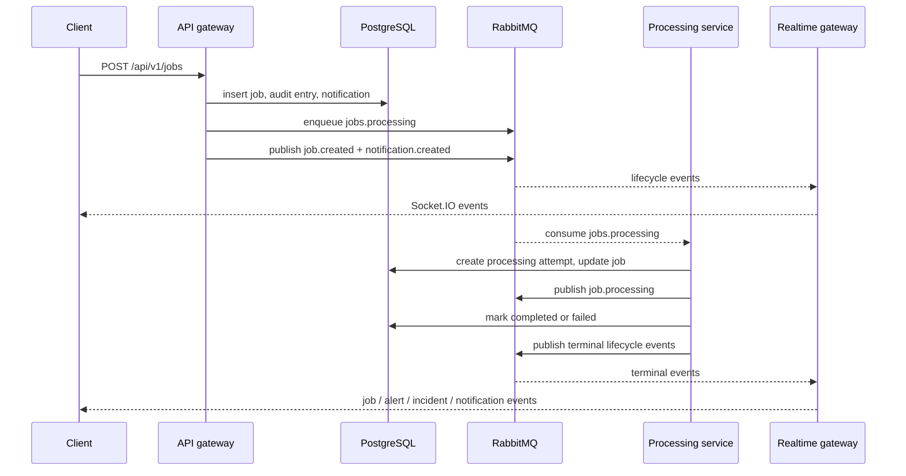

# Architecture

Realtime Ops Platform separates command handling, background execution, and realtime delivery into three NestJS runtimes backed by PostgreSQL, RabbitMQ, and Redis.

Related docs: [README](../README.md), [Domain Model](domain-model.md), [WebSocket Flow](websocket-flow.md), [Local Development](local-development.md)

## Runtime Services

| Service              | Entry point                     | Owns                                                                                                | Depends on                             |
| -------------------- | ------------------------------- | --------------------------------------------------------------------------------------------------- | -------------------------------------- |
| `api-gateway`        | HTTP on `:3001`                 | REST commands and queries, auth, validation, pagination, queue submission, initial lifecycle events | PostgreSQL, RabbitMQ, Redis            |
| `processing-service` | Nest application context worker | Job execution, attempt recording, final job states, alert creation, critical incident creation      | PostgreSQL, RabbitMQ, Redis            |
| `realtime-gateway`   | HTTP + Socket.IO on `:3002`     | WebSocket authentication, room subscriptions, RabbitMQ event consumption, event fanout              | RabbitMQ, Redis, operator token config |

## Shared Libraries

| Library            | Responsibility                                                                                       |
| ------------------ | ---------------------------------------------------------------------------------------------------- |
| `libs/core`        | Entities, enums, and shared domain contracts                                                         |
| `libs/application` | Business services such as `JobService`, `JobProcessorService`, `IncidentService`, and `AuditService` |
| `libs/database`    | TypeORM configuration and migrations                                                                 |
| `libs/messaging`   | RabbitMQ lifecycle, durable queue/exchange setup, publish/consume helpers                            |
| `libs/redis`       | Redis client lifecycle and per-job lock helper                                                       |
| `libs/auth`        | Operator token validation, request guard, and Redis-backed rate limiting                             |
| `libs/common`      | Response envelope, global exception filter, pagination DTOs                                          |

## Component View

```mermaid
flowchart LR
    U["Operator or reviewer"] -->|HTTP| API["API gateway"]
    U -->|Socket.IO| RT["Realtime gateway"]
    API --> PG[("PostgreSQL")]
    API -->|sendToQueue| Q["jobs.processing"]
    API -->|publishEvent| X["ops.events"]
    API -->|fixed-window counters| R[("Redis")]
    Q --> W["Processing service"]
    W --> PG
    W -->|lock job-processing-lock:{jobId}| R
    W -->|publishEvent| X
    X -->|queue binding: #| RT
    RT -->|topic fanout| U
```

## Service Responsibilities

### API Gateway

The API gateway is the command and query edge of the system.

- Applies `helmet`, global validation, structured error responses, and response envelopes.
- Enforces `x-operator-token` and `x-operator-id` on non-public routes.
- Persists jobs, alerts, operator actions, notifications, and audit entries through application services.
- Publishes new work to RabbitMQ and emits lifecycle events for creation-side actions.
- Exposes operational read models such as job status and processing summary.

### Processing Service

The processing service is intentionally isolated from request handling.

- Consumes the durable `jobs.processing` queue.
- Acquires a Redis lock per job before starting execution.
- Increments `attemptCount` when an attempt begins and writes a `processing_attempts` row.
- Marks the job `completed` or `failed` and records attempt timing/error details.
- Creates alerts for failures and creates incidents when the failure has crossed the job's `maxAttempts` threshold.
- Emits lifecycle events to the `ops.events` exchange for realtime delivery.

### Realtime Gateway

The realtime runtime turns RabbitMQ events into Socket.IO broadcasts.

- Accepts connections on the `/realtime` namespace.
- Validates the operator token during the handshake.
- Joins every accepted socket to `operators` and allows optional room subscriptions for `jobs`, `alerts`, `incidents`, and `notifications`.
- Consumes all event topics from the queue named by `REALTIME_EVENTS_QUEUE`.
- Broadcasts events with a `{ topic, payload, emittedAt }` envelope.

## Data and Transport Responsibilities

| Component                  | What it stores or transports                                                                 | Why it exists in the architecture                                                    |
| -------------------------- | -------------------------------------------------------------------------------------------- | ------------------------------------------------------------------------------------ |
| PostgreSQL                 | Jobs, processing attempts, alerts, incidents, notifications, audit entries, operator actions | Durable system of record for workflow state and reviewer-visible operational history |
| RabbitMQ `jobs.processing` | Command-side work submissions                                                                | Decouples request acceptance from background execution                               |
| RabbitMQ `ops.events`      | Lifecycle topics such as `job.*`, `alert.raised`, `incident.updated`, `notification.created` | Standardizes downstream event delivery for realtime consumers                        |
| Redis                      | Rate-limit counters and per-job locks                                                        | Adds lightweight coordination without turning Redis into a source of truth           |

## End-to-End Flow



## Architectural Constraints

- PostgreSQL is the source of truth. Redis is coordination-only and RabbitMQ is transport-only.
- Retry behavior is explicit and operator-driven. The current implementation does not do automatic backoff or dead-letter processing.
- Realtime delivery is currently single-gateway in behavior. The repository does not include a distributed Socket.IO adapter for multi-instance fanout.
- The access model is operator-authenticated but not yet role-based. This is a conscious scope boundary, not an omitted detail.
