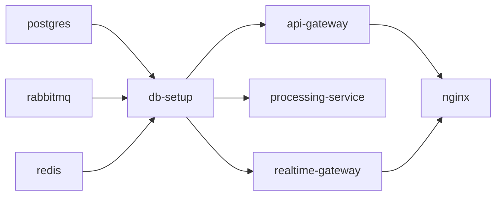

# Deployment Notes

The repository is Docker-first and local-environment oriented, but the service split and runtime contracts are close to what a production deployment would use.

Related docs: [README](../README.md), [Architecture](architecture.md), [Security](security.md), [Local Development](local-development.md)

## Container Topology

| Container            | Purpose                                                 |
| -------------------- | ------------------------------------------------------- |
| `api-gateway`        | REST API for commands, queries, health, and Swagger     |
| `processing-service` | Queue worker for job execution and failure side effects |
| `realtime-gateway`   | Socket.IO server plus RabbitMQ event consumer           |
| `postgres`           | Primary relational datastore                            |
| `rabbitmq`           | Work queue and event bus                                |
| `redis`              | Rate limiting and lock coordination                     |
| `db-setup`           | One-shot migration and seed step                        |
| `nginx`              | Optional local reverse proxy                            |

## Startup Sequence

Operational meaning:

- infrastructure services must become healthy first
- `db-setup` runs migrations and conditional seeding
- application services start only after `db-setup` succeeds

## Runtime Configuration

| Variable                    | Purpose                                                |
| --------------------------- | ------------------------------------------------------ |
| `API_PORT`                  | API gateway HTTP port                                  |
| `REALTIME_PORT`             | Realtime gateway HTTP and Socket.IO port               |
| `DATABASE_URL`              | PostgreSQL connection string                           |
| `RABBITMQ_URL`              | RabbitMQ connection string                             |
| `REDIS_URL`                 | Redis connection string                                |
| `OPERATOR_API_TOKEN`        | Shared operator token for REST and WebSocket auth      |
| `RATE_LIMIT_MAX_REQUESTS`   | Max requests per API rate-limit window                 |
| `RATE_LIMIT_WINDOW_SECONDS` | API rate-limit window size                             |
| `REALTIME_EVENTS_QUEUE`     | Queue name used by the realtime gateway event consumer |

## Scaling Notes

| Runtime            | Current scaling posture                       | Constraint to know                                                                   |
| ------------------ | --------------------------------------------- | ------------------------------------------------------------------------------------ |
| API gateway        | Can sit behind a reverse proxy                | Auth model is shared-token based, not per-user session based                         |
| Processing service | Can scale by adding more queue consumers      | Per-job concurrency depends on Redis locking rather than queue partitioning          |
| Realtime gateway   | Best treated as a single broadcast edge today | No Socket.IO adapter is implemented for cross-instance fanout                        |
| PostgreSQL         | Durable source of truth                       | Schema is migration-based and not intended to be replaced by Redis or RabbitMQ state |
| Redis              | Lightweight coordination tier                 | Losing Redis affects rate limiting and locks, not durable workflow history           |

## Delivery Guarantees and Limits

- RabbitMQ queues and exchanges are declared durable.
- Published queue messages and event messages are marked persistent.
- Consumer failures on malformed messages result in `nack(..., false, false)`, which drops the message rather than requeueing it.
- Domain retries are manual business actions, not broker-level retries.

## Reverse Proxy Notes

When `nginx` is used in Docker mode, it proxies:

- `/api/` to `api-gateway:3001`
- `/socket.io/` to `realtime-gateway:3002/socket.io/`
- `/realtime/` to `realtime-gateway:3002/realtime/`

## Operational Checklist

Before treating a deployment as healthy:

1. Confirm PostgreSQL, RabbitMQ, and Redis are reachable.
2. Confirm migrations have run successfully.
3. Confirm `GET /api/v1/health` returns `status: ok`.
4. Confirm a sample job can be created and processed end to end.
5. Confirm the realtime gateway accepts a valid authenticated Socket.IO connection.

## Reviewer Boundaries

This repository intentionally stops short of production orchestration concerns such as:

- Kubernetes manifests
- managed secret rotation
- distributed WebSocket fanout infrastructure
- autoscaling policies
- centralized observability stack provisioning

Those belong in future deployment work, not in the current implementation.
