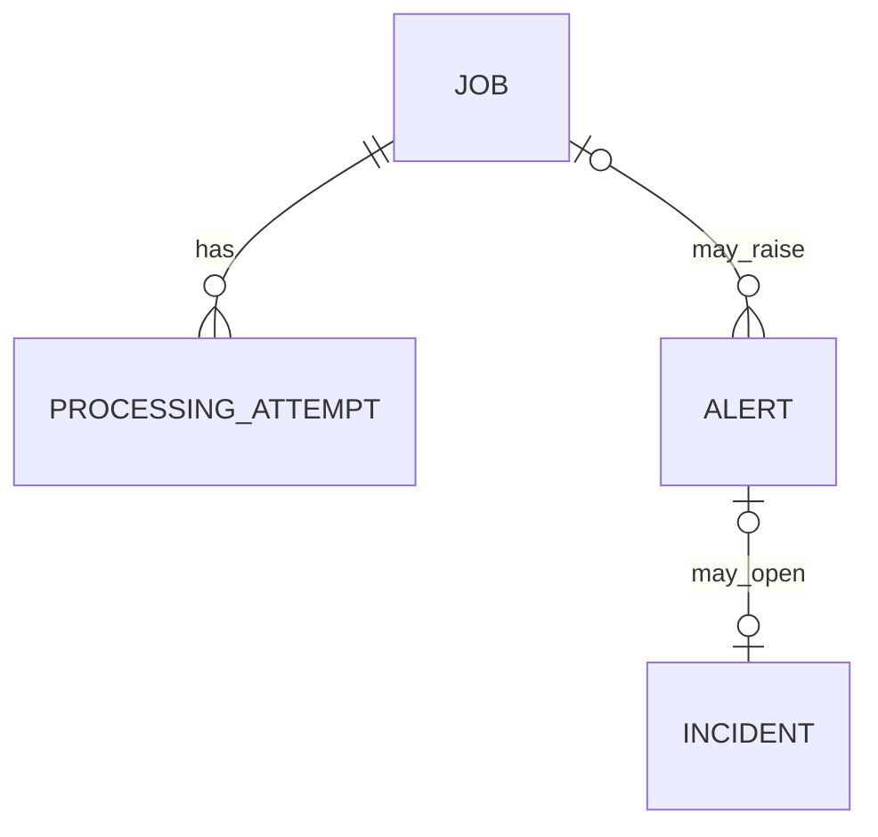
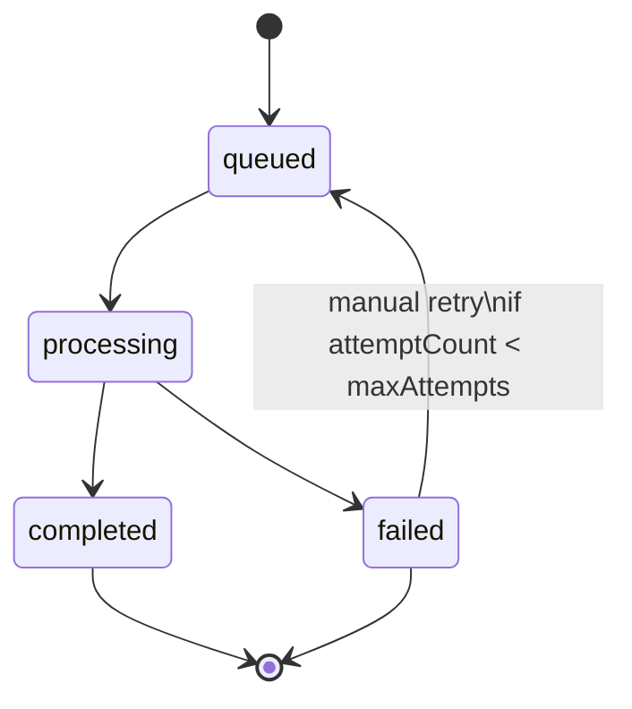

# Domain Model

The domain model is built around operational work moving through a queue-backed lifecycle and producing reviewer-visible operational artifacts along the way.

Related docs: [README](../README.md), [Architecture](architecture.md), [API Overview](api-overview.md), [WebSocket Flow](websocket-flow.md)

## Core Entities

| Entity              | Purpose                                                      | Key fields                                                                         |
| ------------------- | ------------------------------------------------------------ | ---------------------------------------------------------------------------------- |
| `Job`               | Represents asynchronous operational work accepted by the API | `status`, `priority`, `attemptCount`, `maxAttempts`, `payload`, `lastError`        |
| `ProcessingAttempt` | Captures each execution attempt for a job                    | `attemptNumber`, `status`, `startedAt`, `finishedAt`, `durationMs`, `errorMessage` |
| `Alert`             | Signals a failure or operator-raised operational concern     | `severity`, `status`, `title`, `description`, optional `jobId`                     |
| `Incident`          | Operator-managed escalation object tied to a critical alert  | `status`, `alertId`, `acknowledgedBy`, `resolvedBy`                                |
| `Notification`      | Persisted operator feed entry                                | `type`, `channel`, `message`, `metadata`, `readAt`                                 |
| `AuditEntry`        | Immutable history of system and operator actions             | `actorType`, `actorId`, `action`, `entityType`, `entityId`, `metadata`             |
| `OperatorAction`    | Explicit record of operator-issued commands                  | `operatorId`, `action`, `targetType`, `targetId`, `payload`                        |

## Relationship View

Not every operational artifact is modeled with a foreign key:

- `Notification` records hold JSON metadata rather than strict foreign-key links to every affected entity.
- `AuditEntry` records also use `entityType` plus `entityId` instead of direct relational constraints.
- `OperatorAction` is intentionally separate from `AuditEntry` so explicit user commands remain queryable even when system-driven audit history grows.

## Job Lifecycle

### Job Rules

| Rule              | Current behavior                                                                                  |
| ----------------- | ------------------------------------------------------------------------------------------------- |
| Initial state     | Jobs are created as `queued` with `attemptCount = 0`                                              |
| Attempt increment | `attemptCount` increments when the worker starts processing, not when the job is created          |
| Terminal success  | Successful processing marks the job `completed` and clears `lastError`                            |
| Terminal failure  | Failed processing marks the job `failed`, stores `lastError`, and records attempt failure details |
| Retry eligibility | Retry is allowed only when the current status is `failed` and `attemptCount < maxAttempts`        |
| Retry mechanism   | Retry is an explicit API action that re-queues the job; there is no automatic delayed retry       |

## Failure, Alert, and Incident Semantics

| Situation                                                                            | Result                                                                                             |
| ------------------------------------------------------------------------------------ | -------------------------------------------------------------------------------------------------- |
| A processing attempt fails before `maxAttempts` is reached                           | A `high` severity alert is raised and the job remains `failed` until an operator retries it        |
| A processing attempt fails at or beyond `maxAttempts`                                | A `critical` severity alert is raised and an incident is opened automatically                      |
| An operator creates a critical alert or sets `createIncident=true` on alert creation | An incident is opened immediately                                                                  |
| An incident is acknowledged                                                          | The incident becomes `acknowledged` and the linked alert, if present, is updated to `acknowledged` |
| An incident is resolved                                                              | The incident becomes `resolved` and the linked alert, if present, is updated to `resolved`         |

### Incident Transition Rules

| Transition                 | Allowed | Notes                                                      |
| -------------------------- | ------- | ---------------------------------------------------------- |
| `open -> acknowledged`     | Yes     | Stores `acknowledgedBy` and `acknowledgedAt`               |
| `acknowledged -> resolved` | Yes     | Stores `resolvedBy` and `resolvedAt`                       |
| `open -> resolved`         | Yes     | Resolution implicitly fills acknowledgement metadata first |
| `resolved -> acknowledged` | No      | Rejected by the service                                    |
| `resolved -> resolved`     | No      | Rejected as already resolved                               |

## Notification Model

Notification generation is selective rather than exhaustive.

| Trigger                        | Notification type | Current implementation                                                              |
| ------------------------------ | ----------------- | ----------------------------------------------------------------------------------- |
| Job created                    | `job_status`      | Creates "job queued" notification                                                   |
| Job retried                    | `job_status`      | Creates "queued for retry" notification                                             |
| Job completed                  | `job_status`      | Creates "completed successfully" notification                                       |
| Job failed in worker           | `alert`           | Creates failure-alert notification with job, alert, and optional incident metadata  |
| Manual alert creation          | None              | Audited and broadcast in realtime, but does not currently create a notification row |
| Incident acknowledge / resolve | None              | Audited and broadcast in realtime, but does not currently create a notification row |

## Audit and Operator History

| Record type      | Why it exists                                                                                                                         |
| ---------------- | ------------------------------------------------------------------------------------------------------------------------------------- |
| `AuditEntry`     | Captures both system and operator actions for jobs, alerts, incidents, and notifications using immutable append-only records          |
| `OperatorAction` | Captures explicit operator commands such as `job.create`, `job.retry`, `alert.create`, `incident.acknowledge`, and `incident.resolve` |

This split keeps the platform auditable from two angles:

- What happened in the system.
- Which operator action caused a state transition.

## Reviewer Notes

- The domain model is intentionally optimized for operational clarity over abstract purity.
- PostgreSQL relationships are strongest where they affect workflow integrity: jobs to attempts, jobs to alerts, and alerts to incidents.
- Notification and audit records deliberately keep looser coupling so the platform can log cross-cutting activity without forcing every event into a hard relational graph.
