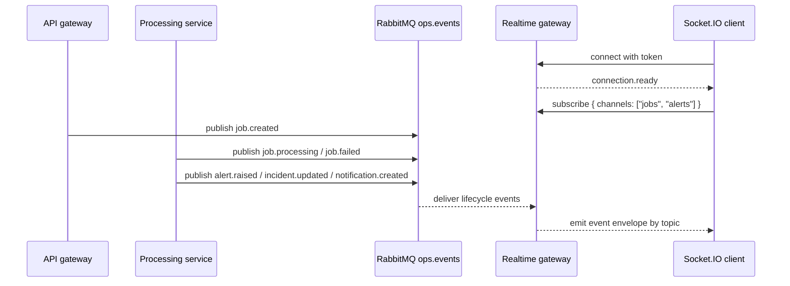

# WebSocket Flow

The realtime gateway turns RabbitMQ lifecycle events into authenticated Socket.IO traffic for operator-facing visibility.

Related docs: [README](../README.md), [Architecture](architecture.md), [API Overview](api-overview.md)

## Connection Model

| Item                     | Current behavior                                                                       |
| ------------------------ | -------------------------------------------------------------------------------------- |
| Namespace                | `/realtime`                                                                            |
| Transport                | Socket.IO                                                                              |
| Token source             | Socket.IO auth payload, query string, or `x-operator-token` header                     |
| Operator identity source | Socket.IO auth payload, query string, or `x-operator-id` header                        |
| Fallback operator ID     | `observer` when no operator ID is provided                                             |
| Connection result        | Invalid token disconnects the socket immediately; valid token emits `connection.ready` |

Example handshake auth payload:

```json
{
  "token": "ops-local-token",
  "operatorId": "operator-1"
}
```

## Rooms and Subscriptions

Every accepted socket joins the `operators` room automatically. Clients can also manage explicit channel subscriptions.

| Client event  | Payload                              | Effect                 |
| ------------- | ------------------------------------ | ---------------------- |
| `subscribe`   | `{ "channels": ["jobs", "alerts"] }` | Joins supported rooms  |
| `unsubscribe` | `{ "channels": ["jobs"] }`           | Leaves supported rooms |

Supported channel rooms:

| Channel         | Room name       | Event topics routed there |
| --------------- | --------------- | ------------------------- |
| `jobs`          | `jobs`          | `job.*`                   |
| `alerts`        | `alerts`        | `alert.*`                 |
| `incidents`     | `incidents`     | `incident.*`              |
| `notifications` | `notifications` | `notification.*`          |

Unknown channel names are ignored.

## Event Families

The gateway consumes all lifecycle events from the queue named by `REALTIME_EVENTS_QUEUE` and broadcasts a standard envelope:

```json
{
  "topic": "job.completed",
  "payload": {
    "jobId": "8f1b1af0-1c3e-478c-9979-0d06ebc210c7",
    "attemptNumber": 1
  },
  "emittedAt": "2026-03-14T12:00:00.000Z"
}
```

| Topic                  | Produced when                                                    |
| ---------------------- | ---------------------------------------------------------------- |
| `job.created`          | A job is created or re-queued for retry                          |
| `job.processing`       | The worker starts a processing attempt                           |
| `job.completed`        | A job attempt completes successfully                             |
| `job.failed`           | A job attempt fails                                              |
| `alert.raised`         | An alert is persisted for a failed job or operator-created alert |
| `incident.updated`     | An incident is created, acknowledged, or resolved                |
| `notification.created` | A notification row is persisted                                  |

Important accuracy note:

- The codebase has an internal publisher for `alert.acknowledged`, but the current public API does not expose an alert-acknowledge route and the incident flow updates the alert record without publishing that topic. Reviewers should treat the event families above as the actively implemented external contract.

## Fanout Path



## Delivery Semantics

The current gateway broadcast behavior is simple and explicit:

- Every lifecycle event is emitted to the `operators` room.
- The same event is then emitted to the matching channel room based on its topic prefix.
- A client subscribed to both the global operator room and a matching channel room can observe duplicate deliveries of the same event.

This is acceptable for the current portfolio scope because:

- The routing behavior is easy to inspect and test.
- The client-side contract is straightforward.
- The repository does not currently implement replay, offset tracking, or distributed fanout guarantees.

## Reviewer Demo Path

1. Start the API, processing, and realtime services.
2. Connect a Socket.IO client to `ws://localhost:3002/realtime` with `token: "ops-local-token"`.
3. Subscribe to `jobs`, `alerts`, `incidents`, and `notifications`.
4. Create a job through the API and watch `job.created`, `job.processing`, then `job.completed` or `job.failed`.
5. Submit a failing job or a critical alert and observe the alert, incident, and notification side effects.

## Verification

The repository already includes realtime unit coverage for:

- unauthorized handshake rejection
- channel filtering during subscribe
- room routing for job and incident topics

For test entry points, see [tests/unit/realtime-events.gateway.spec.ts](../tests/unit/realtime-events.gateway.spec.ts).
